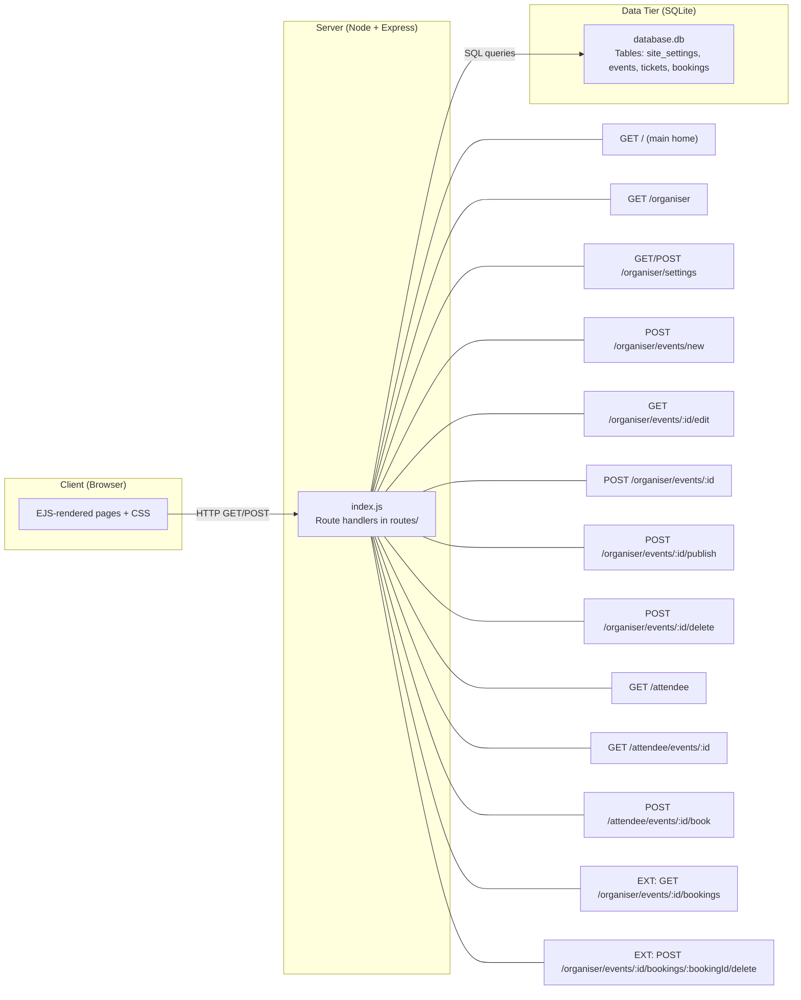
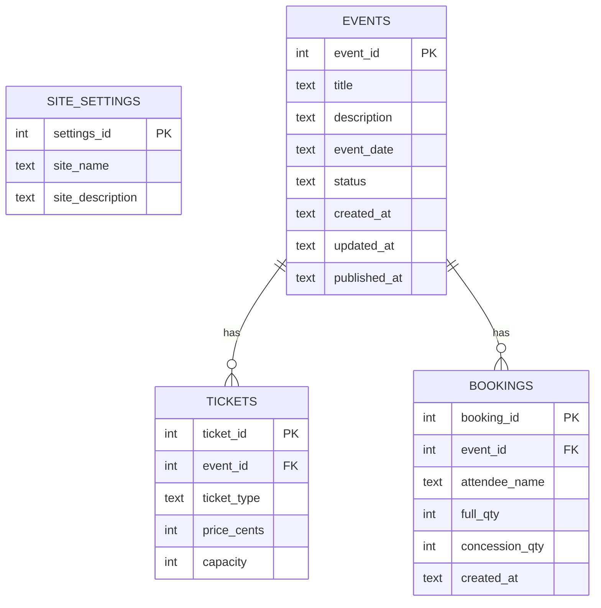

# Event Manager Report

## 1) Architecture Overview (Three-Tier + Endpoints)

**Summary**  
The application is a three-tier web app. The browser requests server-rendered pages (EJS) from an Express.js server. The server reads/writes persistent data in a SQLite database. The organiser and attendee pages are separate routes, and the extension adds organiser-side booking management.

**Architecture diagram (Mermaid)**


---

## 2) Data Model (ER Diagram)

**Summary**  
Events are stored in `events`. Each event has ticket rows (`tickets`) and attendee bookings (`bookings`). `site_settings` is a single-row config table for the organiser's site name/description. The extension uses `bookings` to display and cancel bookings from the organiser side.

**ER diagram (Mermaid, crow's-foot)**


---

## 3) Extension: Organiser Booking Management

**What the extension does**  
Adds organiser-side booking management so the organiser can view all bookings for an event and cancel any booking. This provides practical administration of bookings beyond the attendee flow.

**Implementation summary**  
- New organiser route to list bookings for an event plus totals for full and concession tickets.  
- Cancel route to delete a booking and refresh the list.  
- A bookings page template to render totals and individual booking rows.  
- A "View bookings" link on each published event in the organiser home page.

**Course techniques used**  
- Express routing and middleware for GET/POST endpoints.  
- SQL queries with aggregation (SUM/COALESCE).  
- Server-side rendering with EJS.  
- Persistent SQLite storage with FK constraints.

**Beyond the base requirements**  
The base spec covers attendee booking but not organiser-side booking admin. This extension expands server-side functionality for organisers, adds useful data summaries, and supports administrative actions (cancel booking).

**Code references and excerpts**

- Bookings list + totals  
  `routes/organiser.js#L327` – `routes/organiser.js#L379`

- Booking cancellation  
  `routes/organiser.js#L383` – `routes/organiser.js#L400`

- Bookings page template  
  `views/organiser-bookings.ejs#L19` – `views/organiser-bookings.ejs#L45`

- Organiser home link to bookings  
  `views/organiser-home.ejs#L46` – `views/organiser-home.ejs#L48`

- Bookings table schema  
  `db_schema.sql#L36` – `db_schema.sql#L44`

**Code excerpts**

```js
// routes/organiser.js#L327-L379
router.get("/events/:id/bookings", function (req, res, next) {
    const eventId = req.params.id;
    const eventQuery = "SELECT * FROM events WHERE event_id = ?";
    global.db.get(eventQuery, [eventId], function (err, event) {
        if (!event) { res.status(404).send("Event not found"); return; }
        const bookingsQuery = `
            SELECT booking_id, attendee_name, full_qty, concession_qty, created_at
            FROM bookings WHERE event_id = ? ORDER BY created_at DESC
        `;
        global.db.all(bookingsQuery, [eventId], function (err2, bookings) {
            const totalsQuery = `
                SELECT COALESCE(SUM(full_qty), 0) AS full_booked,
                       COALESCE(SUM(concession_qty), 0) AS concession_booked
                FROM bookings WHERE event_id = ?
            `;
            global.db.get(totalsQuery, [eventId], function (err3, totals) {
                res.render("organiser-bookings.ejs", { event, bookings, totals });
            });
        });
    });
});
```

```js
// routes/organiser.js#L383-L400
router.post("/events/:id/bookings/:bookingId/delete", function (req, res, next) {
    const deleteQuery = "DELETE FROM bookings WHERE booking_id = ? AND event_id = ?";
    global.db.run(deleteQuery, [req.params.bookingId, req.params.id], function (err) {
        res.redirect(`/organiser/events/${req.params.id}/bookings`);
    });
});
```

```html
<!-- views/organiser-bookings.ejs#L19-L45 -->
<h2>Bookings</h2>
<% if (bookings.length === 0) { %>
  <p class="muted">No bookings yet.</p>
<% } %>
<div class="list">
  <% bookings.forEach(function (booking) { %>
    <article class="list-item">
      <div>
        <h3><%= booking.attendee_name %></h3>
        <p class="muted">Booked: <%= booking.created_at %></p>
        <p>Full: <%= booking.full_qty %> | Concession: <%= booking.concession_qty %></p>
      </div>
      <div class="list-actions">
        <form method="POST" action="/organiser/events/<%= event.event_id %>/bookings/<%= booking.booking_id %>/delete">
          <button class="button danger" type="submit">Cancel</button>
        </form>
      </div>
    </article>
  <% }); %>
</div>
```
